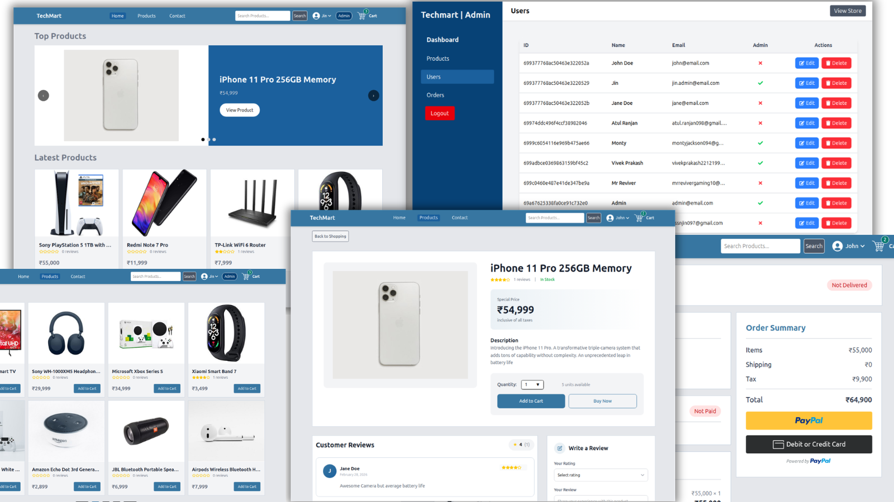

# TechMart - MERN Stack eCommerce Platform

> eCommerce platform built with the MERN stack & Redux.

#### Links
- [Live Demo](https://techmart-epjk.onrender.com/) | [Source Code](https://github.com/atulranjan97/techmart) | [LinkedIn](https://linkedin.com/in/atulranjan97)




## Overview
A full-featured eCommerce platform built with the MERN Stack (MongoDB, Express.js, React.js, and Node.js) along with Redux Toolkit for state management. TechMart provides a complete online shopping experience, including product browsing, cart management, secure authentication, payment integration, order tracking, and an admin dashboard for managing products, users, and orders.


## Features

- Full featured shopping cart
- Product reviews and ratings
- Top products carousel
- Product pagination
- Product search feature
- User profile with orders
- Admin product management
- Admin user management
- Admin Order details page
- Mark orders as delivered option
- Checkout process (shipping, payment method, etc)
- PayPal / credit card integration
- Database seeder (products & users)

## Usage

- Create a MongoDB database and obtain your `MongoDB URI` - [MongoDB Atlas](https://www.mongodb.com/cloud/atlas/register)
- Create a PayPal account and obtain your `Client ID` - [PayPal Developer](https://developer.paypal.com/)

## Project Architecture


```text

TechMart

│

├── backend

│   ├── config

│   ├── controllers

│   ├── middleware

│   ├── models

│   ├── routes

│   ├── seeder.js

│   ├── utils

│   │   ├── calcPrices.js

│   │   ├── generateToken.js

│   │   ├── paypal.js

│   │   └── usdConversion.js

│   └── server.js

│

├── frontend

│   ├── public

│   └── src

│       ├── components

│       ├── pages

│       ├── slices

│       ├── utils

│       │   ├── calcPrices.js

│       │   └── cartUtils.js

│       ├── constants

│       ├── assets

│       └── store.js

│

├── uploads

├── package.json

└── README.md

```


---


## Installation


### Clone the Repository


```bash

git clone https://github.com/your-username/techmart.git


cd techmart

```


### Install Backend Dependencies


```bash

npm install

```


### Install Frontend Dependencies


```bash

cd frontend

npm install

```


---


## Environment Variables


Create a `.env` file inside the backend directory.


```env

NODE_ENV=development
PORT=5000
MONGO_URI=
JWT_SECRET=
PAYPAL_CLIENT_ID=
PAYPAL_APP_SECRET=
PAYPAL_API_URL=https://api-m.sandbox.paypal.com
PAGINATION_LIMIT=8

```


---


## Database Seeder


Import Sample Data


```bash

npm run data:import

```


Remove Sample Data


```bash

npm run data:destroy

```


---


## Running the Application


### Run Backend


```bash

npm run server

```


### Run Frontend


```bash

cd frontend

npm start

```


### Run Backend and Frontend Concurrently


```bash

npm run dev

```
---


## API Endpoints
### Products
```text
GET /api/products
GET /api/products/:id
POST /api/products
PUT /api/products/:id
DELETE /api/products/:id
POST /api/products/:id/reviews
GET /api/products/top
```
### Users
```text
POST /api/users/auth
POST /api/users
POST /api/users/logout
GET /api/users/profile
PUT /api/users/profile
GET /api/users
GET /api/users/:id
DELETE /api/users/:id
PUT /api/users/:id
```
### Orders
```text
POST /api/orders
GET /api/orders/mine
GET /api/orders/:id
PUT /api/orders/:id/pay
PUT /api/orders/:id/deliver
GET /api/orders
GET /api/orders/recent
```
---
<!-- Screenshots
Home Page
Add project screenshots here.


Product Page

Cart Page

Admin Dashboard
 -->

## Learning Outcomes
This project demonstrates practical experience with:

- React Functional Components
- React Hooks
- React Router
- Redux Toolkit
- State Management
- REST APIs
- Express.js
- MongoDB & Mongoose
- Authentication & Authorization
- JWT Security
- Payment Gateway Integration
- Middleware Development
- Error Handling
- Deployment Strategies
- Full Stack Application Architecture
---

## Future Improvements (depends on my mood)
- Wishlist Functionality
- Coupon & Discount System
- Inventory Management
- Email Notifications
- Stripe Integration
- Multi-Vendor Marketplace Support
- Product Recommendation Engine
- Advanced Analytics Dashboard
---

## Contributing
Contributions are welcome.
- Fork the repository

- Create a feature branch
```text
git checkout -b feature/new-feature
```
- Commit changes
```text
git commit -m "Add new feature"
```

- Push changes
```text
git push origin feature/new-feature
```

Open a Pull Request
---

## License
This project is licensed under the MIT License.
---

## Author
**Atul**
Full Stack Developer
Built as a portfolio project to demonstrate full-stack web development skills using MongoDB, Express.js, React.js, Node.js, and Redux Toolkit.
